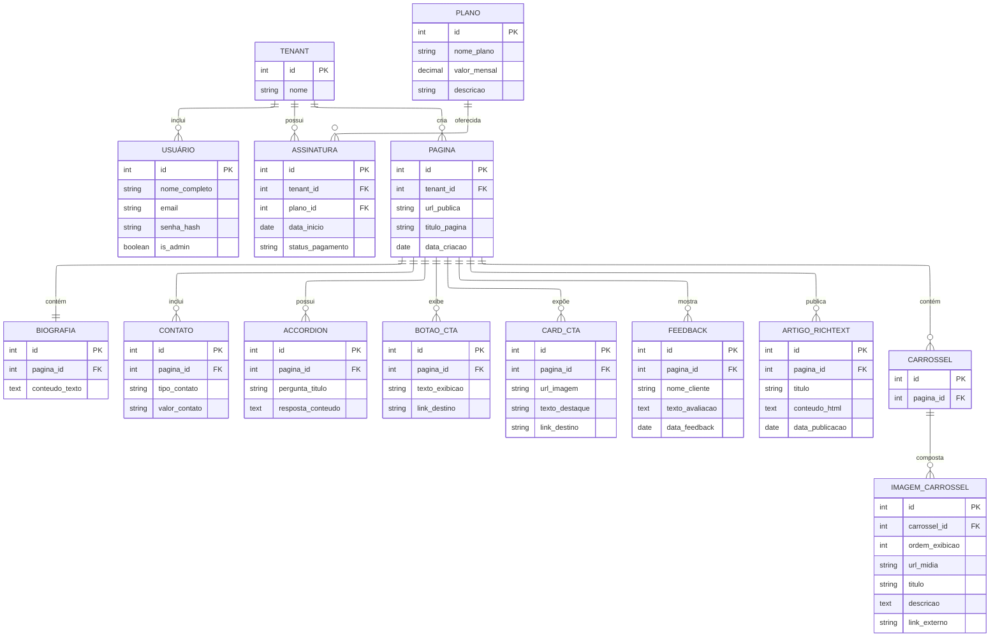

# PBI: Criação do diagrama ER (Entidade Relacional) com Mermaid

## História do Usuário
Como membro da equipe de desenvolvimento, quero elaborar o diagrama Entidade-Relacionamento (ER) do sistema utilizando a sintaxe Mermaid, para documentar a estrutura do banco de dados e garantir o correto mapeamento da arquitetura multi-tenant antes de iniciarmos a implementação do código e das *queries*.

## Casos de uso 

### Caso de uso 1: Consulta estrutural durante o desenvolvimento
Os desenvolvedores consultarão o diagrama renderizado para guiar a criação de *migrations*, entidades, tabelas e relacionamentos, garantindo a integridade referencial ao modelar os dados do painel do cliente.

### Caso de uso 2: Validação da segurança e isolamento de dados
O time utilizará o diagrama visual para auditar a arquitetura, assegurando que todas as informações (portfólios, mídias, feedbacks) estejam rigorosamente amarradas e restritas ao profissional correto, prevenindo vazamentos de dados entre contas.

## Regras de negócio

* **Isolamento Multi-Tenant (RNF01):** O diagrama deve refletir obrigatoriamente a arquitetura de isolamento de instâncias. Todas as tabelas que armazenam dados sensíveis ou de customização de página devem possuir uma chave estrangeira (ex: `tenant_id`) relacionando diretamente a informação ao usuário inquilino isolado.
* **Gestão Comercial (RF11):** A modelagem deve prever o vínculo entre as contas dos profissionais (tenants) e o módulo de gerenciamento de assinaturas e planos mensais recorrentes, permitindo o controle de status financeiro.

## Critérios de Aceite

* O código Mermaid (`erDiagram`) deve renderizar visualmente sem apresentar erros de sintaxe no repositório de documentação.
* O diagrama deve sinalizar claramente as chaves primárias (PK) e chaves estrangeiras (FK) de cada entidade mapeada.
* Todas as cardinalidades de relacionamento (1:1, 1:N, N:M) devem estar declaradas explicitamente e coerentes com as regras multi-tenant do sistema.
* O diagrama deve incluir a tipagem de dados (ex: `uuid`, `varchar`, `boolean`, `timestamp`).

## Definição de Pronto (DoD)

* O script em formato Mermaid foi integrado com sucesso ao arquivo oficial de documentação do projeto.
* O modelo proposto reflete todos os requisitos funcionais de persistência de dados.
* O diagrama foi revisado e aprovado pelos desenvolvedores da equipe técnica.

## Er

